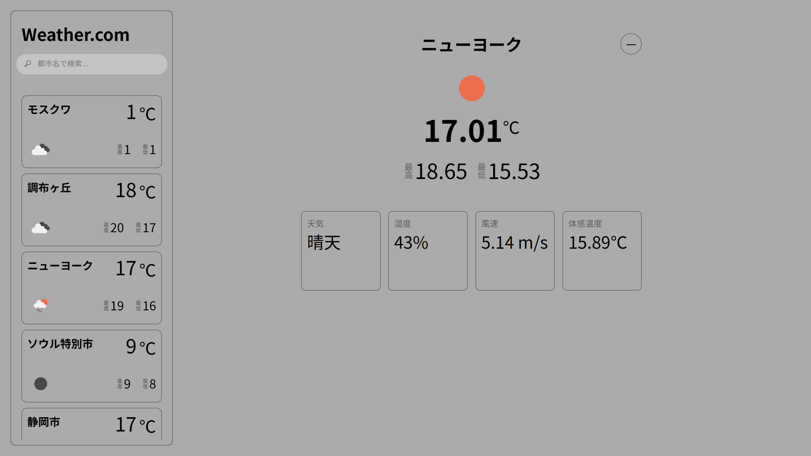

# Weather.com (React + OpenWeather API)

OpenWeather API を使用し、現在地や世界中の都市の天気をチェックできる React アプリケーションです。

## 概要
サイドバーで都市の検索とお気に入りの管理を行い、メインコンテンツで詳細な天気情報を表示します。
- **現在地の天気**: ホーム画面（`/`）で、ブラウザの GPS を利用した現在地の天気をリアルタイム表示。
- **検索 & お気に入り**: サイドバーから都市を検索し、緯度・経度ベースでお気に入りに登録。
- **詳細表示**: 湿度、風速、体感温度、天候アイコンなどの詳細情報を確認。
- **データ保持**: LocalStorage を使用してお気に入りリストを保存。

## サンプル画像


## ルーティング


| パス | ページ内容 | 説明 |
| :--- | :--- | :--- |
| `/` | Home | **現在地**（ブラウザの座標）の天気一覧を表示。 |
| `/weather/:lat/:lon` | Detail | お気に入り等から選択した**特定地点**の最新の天気を詳細表示。 |

## 技術スタック
- **Frontend**: React (TypeScript)
- **Routing**: React Router
- **API**: OpenWeather API (Current Weather Data)
- **Tooling**: Vite
- **Other**: Browsers Geolocation API (現在地取得)

## セットアップ

1. **リポジトリをクローン**
   ```bash
   git clone https://github.com/shotarokuroiwa/Weather.com.git
   ```

2. **依存関係のインストール**
   ```bash
   npm install
   ```

3. **環境変数の設定**
   ルートディレクトリに `.env` ファイルを作成し、APIキーを記述してください。
   ```env
   VITE_API_KEY=あなたのOpenWeatherAPIキー
   ```

4. **開発サーバーの起動**
   ```bash
   npm run dev
   ```
